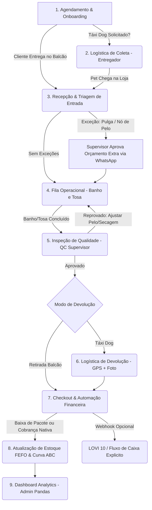

# 🐾 PataForma — Planejamento Estratégico & Prompt de Desenvolvimento

> **Slogan Oficial:** *"PataForma: A plataforma inteligente que faz a operação do seu pet shop rodar com precisão do banho ao caixa."*  
> **Tagline Secundária:** *"Operação, logística e finanças na mesma pata."*

---

## 🎨 Guia Completo de Boas Práticas de UI/UX do PataForma

Para garantir que o **PataForma** seja extremamente simples para o banhista e o motorista, e ao mesmo tempo poderoso e elegante para o gerente e o caixa, estabelecemos o seguinte conjunto de boas práticas de UI/UX:

### 📱 1. Design Responsivo Adaptativo e Zonas de Toque (Touch-First)
- **Área de Toque Mínima (Minimum Touch Target - 48px x 48px)**: Todos os botões em dispositivos móveis (telas de banhistas e motoristas) possuem tamanho mínimo confortável para evitar cliques acidentais com mãos molhadas, luvas ou em movimento.
- **Zona do Polegar (Thumb Zone Ergonomics)**: Botões de ação primária em telas de celular (*ex: "Confirmar Entrega GPS", "Tirar Foto"*) ficam posicionados na metade inferior da tela, ao alcance natural do polegar.
- **Densidade Adaptativa de Tela**: 
  - *Desktop (Admin/Recepção)*: Alta densidade visual com múltiplas colunas Kanban, gráficos e tabelas de caixa aproveitando a largura total do monitor.
  - *Mobile/Tablet (Operacional/Táxi Dog)*: Baixa densidade visual, focado em cards únicos expansíveis com tipografia grande e limpa.

### ⚡ 2. Feedback Visual, Micro-Interações & UI Otimista
- **UI Otimista (Optimistic UI Updates)**: Ao arrastar um card no Kanban ou clicar em "Iniciar Banho", a interface atualiza o estado instantaneamente com micro-animações suaves, enquanto a requisição HTTP é processada em segundo plano.
- **Semântica Visual de Cores (Status Badges)**:
  - `Agendado`: Azul Slate (#64748b)
  - `Em Rota`: Amarelo Alerta (#d97706)
  - `No Banho`: Azul Conforto (#2563eb)
  - `Em Tosa`: Roxo Elegante (#9333ea)
  - `Inspecao QC`: Laranja Alerta (#ea580c)
  - `Pronto`: Verde Esmeralda (#10b981)
  - `Entregue`: Verde Escuro (#047857)
- **Feedback Háptico (Vibração no Celular)**: Resposta tátil com leve vibração ao capturar GPS, enviar foto ou concluir o serviço.

### 🛡️ 3. Prevenção de Erros & Alertas de Segurança em Destaque
- **Badges de Alerta Canino de Alto Contraste**: Avisos de restrição comportamental e de saúde (*Agressivo*, *Alérgico*, *Sensível no Ouvido*, *Pulgas/Carrapatos*) exibidos em banners em vermelho/amarelo de alta visibilidade na tela da banheira.
- **Confirmação para Ações Destrutivas**: Diálogos de confirmação com padrão *Swipe to Action* ou duplo toque para cancelamentos de agendamentos e baixas manuais.

### 📸 4. Eliminação de Fricção na Captura Visual e Leitura
- **Câmera Integrada 1-Clique**: Captura de foto de entrega no Táxi Dog e cadastro de produtos sem código de barras com compressão e pré-visualização instantânea sem sair da tela.
- **Preenchimento Inteligente & Auto-Complete**: Geolocalização via HTML5 GPS sem necessidade de digitação de endereço; busca preditiva de raças e tutores.

### 📶 5. Experiência Offline-First (PWA)
- **Status de Conectividade Visível**: Indicador discreto no topo da tela informando estado online/offline.
- **Fila de Ações Pendentes**: Se o motorista estiver na garagem subterrânea sem sinal, a foto e o GPS são salvos localmente e sincronizados automaticamente com mensagem Toast assim que a conexão retornar.

---

### 👥 2. Matriz de Perfis e Permissões (RBAC & Toggles)

| Perfil | Dispositivo Primário | Módulos Liberados | Função Principal |
| :--- | :--- | :--- | :--- |
| **Cliente / Tutor** | Smartphone (WhatsApp / PWA) | Agendamento, Status em tempo real, Aprovação de Adicionais, Histórico | Acompanhar a jornada do pet, aprovar orçamentos extras e receber avisos. |
| **Funcionário - Banhista / Tosador** | Tablet / Smartphone Operacional | Fila do Banho/Tosa (Kanban simplificado), Registro de Insumos | Iniciar e finalizar procedimentos; notificar intercorrências (nós, ectoparasitas). |
| **Funcionário - Entregador (Táxi Dog)** | Smartphone Mobile | Rota de Coleta/Entrega, GPS HTML5, Captura de Foto, Check-in/Check-out | Buscar e entregar o pet na residência, capturar geolocalização e foto do local. |
| **Funcionário - Recepção / Atendente** | Notebook / Tablet | Agendamento Geral, Kanban Completo, POS/Caixa Nativo, Venda de Produtos com Foto | Recepcionar clientes, efetuar vendas de balcão, gerenciar agenda e pacotes. |
| **Supervisor (Estética / Logística / Estoque)** | Tablet / Notebook | Controle de Qualidade (QC), Reagendamento de Rotas, Ajuste FEFO, Aprovação de Adicionais | Inspecionar pets antes da liberação, resolver exceções operacionais e gerenciar estoque. |
| **Administrador (Dono / Gestor Geral)** | Notebook / Smartphone | Dashboard Analytics (Pandas), Gestão de Módulos (Toggles), DRE, Auditoria | Visualizar faturamento, ticket médio, positivação e parametrizar o sistema. |

---

## 🔄 Os 9 Fluxos Operacionais Interligados do PataForma



### Detalhamento dos Fluxos:

1. **Agendamento, Cadastro & Lembretes Automáticos**:
   - Agendamento do Tutor via WhatsApp ou PWA com seleção de Pet, Serviços e opção de Táxi Dog.
   - Validação de restrições (vacinas, temperamento arisco, alergias) e lembrete automático 24h e 2h antes.

2. **Logística de Coleta (Táxi Dog — Coleta)**:
   - Entregador acessa o app mobile ➔ Clica "Iniciar Coleta" ➔ Captura GPS + Foto do Pet na caixa de transporte ➔ Kanban altera para `Em Rota de Busca` ➔ Notifica o Tutor.

3. **Triagem de Entrada, Check-in & Gestão de Exceções**:
   - Inspeção física na recepção (ectoparasitas, lesões, nó no pelo).
   - *Se houver pulga/carrapato*: Alerta ao Supervisor ➔ Pré-orçamento automático de Banho Antipulgas via WhatsApp do Tutor.
   - Kanban altera para `Aguardando Banho`.

4. **Execução de Banho & Tosa (Fila Operacional)**:
   - Banhista clica "Iniciar Banho" (Kanban: `No Banho`) ➔ Alerta de cuidados exibido na tela ➔ Finalização da secagem ➔ Encaminhamento para Tosador (Kanban: `Em Tosa`) ou para QC.

5. **Controle de Qualidade (QC) do Supervisor & Notificação "Pronto"**:
   - Supervisor de Estética avalia secagem, perfume, unhas e acessórios ➔ Clica "Aprovar QC" ➔ Kanban: `Pronto` ➔ Notificação automática WhatsApp com foto para o Tutor.

6. **Logística de Devolução (Táxi Dog — Entrega)**:
   - Entregador leva o pet ➔ Clica "Confirmar Entrega" ➔ Captura GPS + Foto do Pet entregue ao tutor ➔ Kanban: `Entregue`.

7. **Automação Financeira Nativa & Baixa de Pacotes**:
   - Transição para `Pronto` / `Entregue` dispara o motor financeiro:
     - *Se Tutor tem Pacote Ativo*: Baixa automática em 1 banho no saldo local + comprovante com saldo restante.
     - *Se Serviço Avulso*: Registro nativo em `contas_receber` + entrada no caixa nativo.
     - *Se Webhook LOVI 10 ativo*: Envio assíncrono do evento para o fluxo de caixa externo.

8. **Gestão de Estoque FEFO & Produtos com Foto**:
   - Baixa de produtos no balcão (código de barras ou busca por foto para petiscos/lacinhos sem código) ➔ Aplicação da regra FEFO (baixa do lote mais próximo ao vencimento).

9. **Governança, Audits & Dashboards Analytics (Pandas)**:
   - Visão do Admin: Faturamento em tempo real, Ticket Médio por cliente/raça, Taxa de Positivação (retorno em 30 dias) e auditoria de produtividade da equipe.

---

## ⚡ Matriz de Tratamento de Exceções (Edge Cases)

| Situação de Exceção | Como o PataForma Resolve | Notificação / Ação no App |
| :--- | :--- | :--- |
| **Cliente ausente na entrega do Táxi Dog** | Entregador registra foto e GPS da tentativa. O status muda para `Tentativa Sem Sucesso`. | Envia aviso ao Tutor e cobra taxa de re-deslocamento no caixa nativo. |
| **Pet Agressivo ou Arisco na Banheira** | Banhista marca flag "Atenção Comportamental" no PataForma. | Alerta em vermelho no Kanban; solicita auxílio do Supervisor e bloqueia tosa com tesoura sem focinheira. |
| **Identificação de Pulga/Carrapato na Triagem** | Bloqueia entrada na área comum de banho. Gera pré-orçamento de Banho Antipulgas. | Notificação WhatsApp em 1-clique para autorização do Tutor. |
| **Queda de Conexão com a Internet** | PataForma opera em modo PWA offline (cache local no navegador). | Sincroniza vendas e movimentações do Kanban assim que o sinal reconectar. |
| **Falha no Webhook da API LOVI 10** | O motor financeiro NATIVO grava a receita no banco local normalmente. | Registra no log de falha de integração externa para reenvio automático sem travar a loja. |

---

## 1. Top 30 Softwares de Gestão para Pet Shops e Clínicas (Mercado Global)

Após varredura em plataformas de review de SaaS (Capterra, G2, Software Advice) e fóruns especializados do mercado veterinário e pet care internacional, listamos os 30 sistemas mais bem avaliados:

1. **Gingr**: Líder de mercado em grande escala, focado em hospedagem, creche e banho/tosa com automação pesada de check-in.
2. **MoeGo**: Referência atual em UX/UI moderna, agendamento inteligente por rota de mapa, envio automático de mensagens e fotos pós-serviço.
3. **Pawfinity**: Focado em flexibilidade de workflows, fichas médicas/estéticas altamente customizáveis e CRM avançado.
4. **PetExec**: Plataforma em nuvem veterana, extremamente segura, com gerenciamento completo de pacotes e agendamentos recorrentes.
5. **GrooMore**: Especializado em estúdios de tosadores independentes e pequenos pet shops, com foco em facilidade de uso mobile.
6. **DaySmart Pet (antigo 123Pet)**: Famoso pela retenção de clientes, campanhas automáticas de marketing e gestão financeira de comissões de tosadores.
7. **Groomsoft**: Solução mobile-first focada em tosadores móveis (vans de banho e tosa) e otimização de rotas.
8. **Pet Manager**: Sistema australiano completo com forte controle de estoque, faturamento e integração com terminais de pagamento.
9. **Fresha**: Plataforma de agendamento online 24/7 sem taxa mensal por usuário, excelente para auto-agendamento de tutores.
10. **Happy Pet Tech**: Focado na jornada mobile para motoristas de transporte pet (Táxi Dog) e notificações em tempo real para os donos.
11. **Salonist**: Excelente controle de múltiplos estabelecimentos (franquias), gestão de permissões detalhada e programa de fidelidade.
12. **BookingPress**: Plugin/Software para agendamentos com regras de bloqueio de horários por porte de pet e tipo de pelagem.
13. **Webba Booking**: Solução flexível para agendamento online com cálculo dinâmico de duração de banho baseado na raça.
14. **Quill Booking**: Leve e intuitivo, voltado para pequenos estabelecimentos com foco em experiência do cliente e checkout rápido.
15. **TailDesk**: Focado na gestão de serviços sob demanda com confirmação automática via SMS/WhatsApp.
16. **ProPet**: Portal do cliente completo onde o tutor pode acompanhar fotos, histórico de vacinas e status do serviço em tempo real.
17. **Revelation Pets**: Dashboard extremamente visual para controle de ocupação de baias/gaiolas e status de banho.
18. **PetLinx**: Software neo-zelandês com gestão unificada de loja física (varejo POS), creche e banho e tosa.
19. **Kennel Connection**: Tradicional e robusto para grandes centros operacionais que exigem relatórios financeiros detalhados.
20. **ezyVet**: Focado em clínicas e hospitais veterinários com módulo de estética pet acoplado e histórico clínico unificado.
21. **Vetter Software**: Cloud SaaS com foco em agilidade de atendimento na recepção e fichas digitais de pets.
22. **PetDesk**: App para tutores focado em lembretes de retorno, positivação de clientes e programa de pontos.
23. **Vagaro**: Plataforma generalista adaptada para o setor pet, com excelente ecossistema de pagamentos e POS.
24. **Acuity Scheduling**: Utilizado por pet shops para automação de agenda, formulários de anamnese pet e pagamentos antecipados.
25. **ShakeOut**: Gestão de tarefas operacionais internas em formato de checklists para banhistas e tosadores.
26. **KORU BEAR**: Especializado em venda de assinaturas e controle rigoroso de uso de pacotes de banho semanais/mensais.
27. **Square for Retail**: Otimizado para o caixa de pet shops com leitor de código de barras e gestão rápida de vendas de balcão.
28. **Shopify POS**: Ideal para pet shops omnicanais que vendem produtos tanto na loja física quanto em e-commerce próprio.
29. **Lightspeed Retail**: Gestão avançada de estoque com alertas de ponto de pedido, código de barras e controle de fornecedores.
30. **Zootie**: App moderno focado no engajamento do cliente pós-atendimento com envio de relatórios do comportamento do pet durante o banho.

---

## 4. Prompt Profissional de Engenharia para o PataForma (Pronto para Uso)

```text
Aja como Arquiteto de Software e Desenvolvedor Full-Stack Sênior especialista em UI/UX.

Objetivo:
Desenvolver o MVP funcional do "PataForma" — Software de Gestão Inteligente para Pet Shop.
Slogan: "PataForma: A plataforma inteligente que faz a operação do seu pet shop rodar com precisão do banho ao caixa."

Conceito Arquitetural Obrigatório:
- APLICAÇÃO ÚNICA MODULAR (PWA/Responsive Web App): Trata-se de UMA ÚNICA APLICAÇÃO adaptável a qualquer dispositivo (smartphone, tablet, desktop).
- FEATURE TOGGLES & PERMISSÕES (RBAC): Mapeamento completo para Admin, Recepção, Banhista, Tosador, Supervisor e Entregador. Todas as funcionalidades (Kanban, POS Nativo, Táxi Dog com GPS/Foto, Produtos com Foto, Serviços, FEFO) existem em uma única base de código. O Administrador ativa/desativa os botões e telas para cada perfil.
- 9 FLUXOS INTERLIGADOS: Implementar todo o ciclo de atendimento desde o Agendamento ➔ Coleta Táxi Dog (GPS/Foto) ➔ Triagem/Exceções ➔ Banho & Tosa ➔ Controle de Qualidade QC ➔ Devolução ➔ Financeiro Nativo & Baixa de Pacotes ➔ Estoque FEFO ➔ Dashboards Analytics em Pandas.
- PRODUTOS COM FOTO: O cadastro de produtos deve obrigatoriamente permitir o upload/captura de fotos (para itens sem código de barras como petiscos a granel e coleiras).
- MOTOR FINANCEIRO NATIVO + WEBHOOK DESACOPLADO: Lançamento de vendas e contas a receber no banco de dados nativo do PataForma, com disparo opcional de Webhook para o LOVI 10.

Stack Tecnológica:
- Front-end: HTML5, CSS3 vanilla (Clean UI responsiva) e JavaScript (Fetch API, HTML5 Geolocation, Camera capture/preview).
- Back-end: Python (Flask).
- Banco de Dados / Acesso: MySQL com pymysql.
- Análise de Dados: pandas.
- Comunicação Externa: requests (para integração desacoplada via Webhook com LOVI 10).
- Hospedagem / Deploy: GitHub e Cloudflare.

Primeira Entrega Obrigatória:
1. Script SQL DDL MySQL (incluindo fotos de produtos, serviços, Kanban, finanças locais, controle de exceções e logs).
2. Estrutura de diretórios do projeto.
3. Código Flask `app.py` com suporte a Feature Toggles, finanças locais e Webhooks.
4. Interface HTML/JS Desktop (`index.html`) e Mobile (`mobile_driver.html`).
```

---

## 5. Primeira Entrega Técnica (Código & Schema do PataForma)

### 5.1. Banco de Dados MySQL (`schema.sql` do PataForma)

```sql
CREATE DATABASE IF NOT EXISTS pataforma_db DEFAULT CHARACTER SET utf8mb4 COLLATE utf8mb4_unicode_ci;
USE pataforma_db;

-- 1. Controle de Acesso e Módulos (Feature Toggles por Perfil)
CREATE TABLE usuarios (
    id INT AUTO_INCREMENT PRIMARY KEY,
    nome VARCHAR(100) NOT NULL,
    perfil ENUM('Admin', 'Supervisor', 'Recepcao', 'Banhista', 'Tosador', 'Entregador') NOT NULL,
    email VARCHAR(100) UNIQUE NOT NULL,
    senha_hash VARCHAR(255) NOT NULL,
    modulo_kanban_ativo TINYINT(1) DEFAULT 1,
    modulo_taxi_dog_ativo TINYINT(1) DEFAULT 1,
    modulo_caixa_ativo TINYINT(1) DEFAULT 1,
    modulo_qc_ativo TINYINT(1) DEFAULT 1,
    criado_em TIMESTAMP DEFAULT CURRENT_TIMESTAMP
);

-- 2. CRM: Clientes e Pets (com histórico de temperamento e vacinas)
CREATE TABLE clientes (
    id INT AUTO_INCREMENT PRIMARY KEY,
    nome VARCHAR(100) NOT NULL,
    telefone VARCHAR(20) NOT NULL,
    endereco TEXT,
    lat_lng VARCHAR(100),
    ultima_visita DATE,
    criado_em TIMESTAMP DEFAULT CURRENT_TIMESTAMP
);

CREATE TABLE pets (
    id INT AUTO_INCREMENT PRIMARY KEY,
    cliente_id INT NOT NULL,
    nome VARCHAR(50) NOT NULL,
    raca VARCHAR(50),
    temperamento ENUM('Calmo', 'Arisco', 'Agressivo') DEFAULT 'Calmo',
    vacinas_em_dia TINYINT(1) DEFAULT 1,
    observacoes TEXT,
    FOREIGN KEY (cliente_id) REFERENCES clientes(id) ON DELETE CASCADE
);

-- 3. Catálogo de Serviços e Produtos com Foto
CREATE TABLE servicos (
    id INT AUTO_INCREMENT PRIMARY KEY,
    nome VARCHAR(100) NOT NULL,
    descricao TEXT,
    preco_padrao DECIMAL(10,2) NOT NULL,
    duracao_minutos INT DEFAULT 60
);

CREATE TABLE produtos (
    id INT AUTO_INCREMENT PRIMARY KEY,
    nome VARCHAR(100) NOT NULL,
    codigo_barras VARCHAR(50),
    foto_url TEXT, -- Foto para produtos sem código de barras
    preco_venda DECIMAL(10,2) NOT NULL,
    categoria VARCHAR(50) DEFAULT 'Geral',
    criado_em TIMESTAMP DEFAULT CURRENT_TIMESTAMP
);

-- 4. Pacotes Pré-Pagos Locais
CREATE TABLE pacotes_ativos (
    id INT AUTO_INCREMENT PRIMARY KEY,
    cliente_id INT NOT NULL,
    quantidade_banhos INT NOT NULL DEFAULT 0,
    data_aquisicao DATE NOT NULL,
    FOREIGN KEY (cliente_id) REFERENCES clientes(id)
);

-- 5. Kanban Operacional com Suporte a Exceções e Inspeção de Qualidade (QC)
CREATE TABLE agendamentos_kanban (
    id INT AUTO_INCREMENT PRIMARY KEY,
    pet_id INT NOT NULL,
    servico_id INT NOT NULL,
    status ENUM('Agendado', 'Em Rota de Busca', 'Aguardando Banho', 'No Banho', 'Em Tosa', 'Inspecao QC', 'Pronto', 'Entregue', 'Tentativa Sem Sucesso') DEFAULT 'Agendado',
    data_agendamento DATETIME NOT NULL,
    possui_ectoparasitas TINYINT(1) DEFAULT 0,
    adicional_desembolo DECIMAL(10,2) DEFAULT 0.00,
    qc_aprovado TINYINT(1) DEFAULT 0,
    latitude_entrega VARCHAR(50),
    longitude_entrega VARCHAR(50),
    foto_comprovante_url TEXT,
    atualizado_em TIMESTAMP DEFAULT CURRENT_TIMESTAMP ON UPDATE CURRENT_TIMESTAMP,
    FOREIGN KEY (pet_id) REFERENCES pets(id),
    FOREIGN KEY (servico_id) REFERENCES servicos(id)
);

-- 6. Motor Financeiro Nativo
CREATE TABLE contas_receber (
    id INT AUTO_INCREMENT PRIMARY KEY,
    cliente_id INT NOT NULL,
    descricao VARCHAR(150) NOT NULL,
    valor DECIMAL(10,2) NOT NULL,
    forma_pagamento ENUM('DINHEIRO', 'PIX', 'DEBITO', 'CREDITO', 'BOLETO') DEFAULT 'PIX',
    status ENUM('Pendente', 'Pago', 'Cancelado') DEFAULT 'Pendente',
    origem ENUM('SERVICO_KANBAN', 'VENDA_BALCAO', 'PACOTE') NOT NULL,
    criado_em TIMESTAMP DEFAULT CURRENT_TIMESTAMP,
    FOREIGN KEY (cliente_id) REFERENCES clientes(id)
);

CREATE TABLE movimentacoes_caixa (
    id INT AUTO_INCREMENT PRIMARY KEY,
    tipo ENUM('ENTRADA', 'SAIDA') NOT NULL,
    categoria VARCHAR(50) NOT NULL,
    descricao VARCHAR(200) NOT NULL,
    valor DECIMAL(10,2) NOT NULL,
    data_movimentacao TIMESTAMP DEFAULT CURRENT_TIMESTAMP
);

-- 7. Estoque FEFO
CREATE TABLE lotes_estoque (
    id INT AUTO_INCREMENT PRIMARY KEY,
    produto_id INT NOT NULL,
    quantidade INT NOT NULL,
    data_vencimento DATE NOT NULL,
    status ENUM('Disponivel', 'Esgotado', 'Vencido') DEFAULT 'Disponivel',
    FOREIGN KEY (produto_id) REFERENCES produtos(id)
);

-- 8. Logs de Webhook Externa (ex: LOVI 10)
CREATE TABLE logs_integracao_externa (
    id INT AUTO_INCREMENT PRIMARY KEY,
    referencia_local_id INT NOT NULL,
    sistema_destino VARCHAR(50) DEFAULT 'LOVI10',
    external_id VARCHAR(100) NOT NULL,
    status_envio ENUM('SUCESSO', 'ERRO', 'DESATIVADO') NOT NULL,
    resposta_api TEXT,
    criado_em TIMESTAMP DEFAULT CURRENT_TIMESTAMP
);
```

### 5.2. Back-end `app.py` em Python Flask (PataForma Engine)

```python
from flask import Flask, render_template, request, jsonify
import pymysql
import requests
import pandas as pd
from datetime import datetime
import pytz

app = Flask(__name__)

DB_CONFIG = {
    'host': 'localhost',
    'user': 'root',
    'password': 'sua_senha',
    'database': 'pataforma_db',
    'cursorclass': pymysql.cursors.DictCursor
}

# Configuração de Integração Externa (Opcional LOVI 10)
LOVI10_INTEGRATION_ENABLED = True
LOVI_API_URL = 'https://api.lovi10.com.br/api/v1/webhook/petshop'
LOVI_API_TOKEN = 'SEU_API_TOKEN'
LOVI_CNPJ = '12345678000195'

def get_db_connection():
    return pymysql.connect(**DB_CONFIG)

def notificar_lovi10_webhook(external_id, pet_nome, cliente_nome, valor):
    if not LOVI10_INTEGRATION_ENABLED:
        return True, "Desativado"
    headers = {
        'Content-Type': 'application/json',
        'Authorization': f'Bearer {LOVI_API_TOKEN}',
        'X-Company-CNPJ': LOVI_CNPJ
    }
    payload = {
        "external_id": external_id,
        "data_evento": datetime.now(pytz.timezone('America/Sao_Paulo')).isoformat(),
        "tipo_transacao": "RECEITA",
        "origem": "PETSHOP_SERVICOS",
        "categoria": "Banho e Tosa",
        "descricao": f"PataForma - Pet: {pet_nome} (Cliente: {cliente_nome})",
        "valor_total": float(valor),
        "forma_pagamento": "PIX",
        "status_financeiro": "LIQUIDADO"
    }
    try:
        r = requests.post(LOVI_API_URL, json=payload, headers=headers, timeout=4)
        return (True, r.json()) if r.status_code in [200, 201] else (False, r.text)
    except Exception as e:
        return False, str(e)

@app.route('/')
def index():
    return render_template('index.html')

@app.route('/driver')
def driver_mobile():
    return render_template('mobile_driver.html')

# API: Transição do Kanban com Inspeção de Qualidade (QC) e Lançamento Nativo
@app.route('/api/kanban/atualizar_status', methods=['POST'])
def atualizar_status_kanban():
    data = request.json
    kanban_id = data.get('id')
    novo_status = data.get('status')
    lat = data.get('latitude')
    lng = data.get('longitude')
    foto_comprovante = data.get('foto_base64')
    adicional_desembolo = data.get('adicional_desembolo', 0.0)

    conn = get_db_connection()
    try:
        with conn.cursor() as cursor:
            cursor.execute("""
                SELECT k.id, s.nome as servico_nome, s.preco_padrao, p.nome as pet_nome, c.id as cliente_id, c.nome as cliente_nome
                FROM agendamentos_kanban k
                JOIN pets p ON k.pet_id = p.id
                JOIN clientes c ON p.cliente_id = c.id
                JOIN servicos s ON k.servico_id = s.id
                WHERE k.id = %s
            """, (kanban_id,))
            info = cursor.fetchone()
            if not info:
                return jsonify({"success": False, "error": "Agendamento não encontrado"}), 404

            cursor.execute("""
                UPDATE agendamentos_kanban 
                SET status = %s, latitude_entrega = COALESCE(%s, latitude_entrega),
                    longitude_entrega = COALESCE(%s, longitude_entrega),
                    foto_comprovante_url = COALESCE(%s, foto_comprovante_url),
                    adicional_desembolo = COALESCE(%s, adicional_desembolo)
                WHERE id = %s
            """, (novo_status, lat, lng, foto_comprovante, adicional_desembolo, kanban_id))

            log_msg = ""
            if novo_status in ['Pronto', 'Entregue']:
                cursor.execute("SELECT id, quantidade_banhos FROM pacotes_ativos WHERE cliente_id = %s AND quantidade_banhos > 0 LIMIT 1", (info['cliente_id'],))
                pacote = cursor.fetchone()

                if pacote:
                    cursor.execute("UPDATE pacotes_ativos SET quantidade_banhos = quantidade_banhos - 1 WHERE id = %s", (pacote['id'],))
                    log_msg = "Baixa efetuada em pacote pré-pago local."
                else:
                    valor_total = float(info['preco_padrao']) + float(adicional_desembolo)
                    cursor.execute("""
                        INSERT INTO contas_receber (cliente_id, descricao, valor, status, origem)
                        VALUES (%s, %s, %s, 'Pago', 'SERVICO_KANBAN')
                    """, (info['cliente_id'], f"{info['servico_nome']} - Pet: {info['pet_nome']}", valor_total))

                    cursor.execute("""
                        INSERT INTO movimentacoes_caixa (tipo, categoria, descricao, valor)
                        VALUES ('ENTRADA', 'Serviço', %s, %s)
                    """, (f"Serviço PataForma: {info['pet_nome']}", valor_total))
                    
                    cobranca_id = cursor.lastrowid
                    log_msg = "Receita gravada nativamente no PataForma."

                    ext_id = f"PATAFORMA-{kanban_id}"
                    sucesso_ext, resp_ext = notificar_lovi10_webhook(ext_id, info['pet_nome'], info['cliente_nome'], valor_total)
                    cursor.execute("""
                        INSERT INTO logs_integracao_externa (referencia_local_id, sistema_destino, external_id, status_envio, resposta_api)
                        VALUES (%s, 'LOVI10', %s, %s, %s)
                    """, (cobranca_id, ext_id, 'SUCESSO' if sucesso_ext else 'ERRO', str(resp_ext)))

        conn.commit()
        return jsonify({"success": True, "message": f"PataForma: Status -> {novo_status}. {log_msg}"}), 200
    except Exception as e:
        conn.rollback()
        return jsonify({"success": False, "error": str(e)}), 500
    finally:
        conn.close()

if __name__ == '__main__':
    app.run(debug=True, host='0.0.0.0', port=5000)
```
